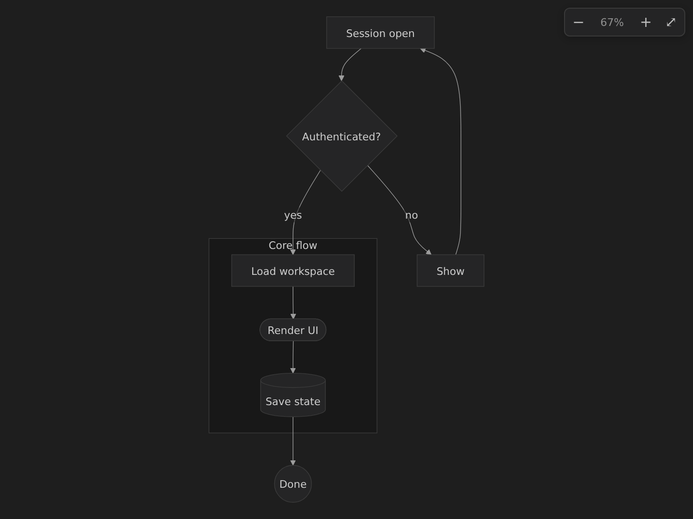

# Mermaid Node Editor

A sidebar editor for Mermaid flowchart nodes. Click into a diagram and a searchable panel lists its nodes; change a node's label or ID and it's written straight back to your file. Renaming an ID also updates every edge that references it — from the panel or with **F2** — so there's no find-and-replace. Jump to a tag's definition, find all its references, and get a warning when the same id names two different elements.

<p align="center">
  
</p>

## Features

- **Live preview** — render the diagram beside your source with the real Mermaid engine; it updates as you type, matches your theme, and has cursor-centered zoom / pan / fit
- **Preview ↔ source sync** — the node under your source cursor lights up in the preview; click a node in the preview to jump to it in the source and the panel
- A dedicated **Activity Bar** panel: a searchable, master-detail node list that scales to large diagrams
- Edit node labels and IDs; renaming an ID updates all of its edges
- **Rename from the editor too** — `F2` / Rename Symbol on a tag (same edge propagation)
- **Go to Definition** (`F12`) and **Find All References** (`Shift+F12`) on any tag
- **Duplicate-tag warnings** — a squiggle + Problems entry when one id names two different elements
- Selection sync: your cursor in the source highlights the matching node, and clicking a node reveals it in the source
- Edit subgraph titles; see each node's incoming and outgoing connections
- Works in `.mmd` / `.mermaid` files and ` ```mermaid ` blocks in Markdown
- Follows your VS Code theme

Flowcharts only (`graph` / `flowchart`). Other diagram types show an "unsupported" notice.

## Live preview

See your diagram rendered beside the source — it re-renders as you edit, matches your VS Code theme, and gives you cursor-centered zoom, drag-to-pan, and fit-to-view.

The preview is **editing-aware**: put your cursor on a tag in the source and its node lights up with a soft theme-colored outline; click any node or subgraph in the preview to jump to its declaration in the source and select it in the node-editor panel (a drag still pans — only a clean click navigates). Toggle the highlight with the ◉ toolbar button or the `mermaid-node-editor.preview.highlightOnSelect` setting; click-to-navigate works either way. (The subtle box around the tag word in the source editor itself is VS Code's own occurrence highlighting — `editor.occurrencesHighlight` — not part of this toggle.)

<p align="center">
  
</p>

Run **Mermaid: Open Preview to the Side** — or the preview icon in the editor title bar — on any `.mmd` file or ` ```mermaid ` block. It renders with the real Mermaid library, supports **ELK layout** (`config: layout: elk`, including a Markdown file's page-level frontmatter), follows your cursor between diagrams, and shows a clear notice for an unsupported diagram type or a parse error.

## Install

Install from the [VS Code Marketplace](https://marketplace.visualstudio.com/items?itemName=SS-inkwright.mermaid-node-editor), or from the command line:

```bash
code --install-extension SS-inkwright.mermaid-node-editor
```

## Usage

Open a `.mmd` file, or a Markdown file with a ` ```mermaid ` block, and put your cursor inside the diagram. Click the **Mermaid Node Editor** icon in the Activity Bar (or run **Mermaid: Open Node Editor** from the Command Palette). Click a node row to expand its editor, filter the list with the search box, and click away to apply an edit.

In the source itself, any tag also supports the standard editor gestures: **Go to Definition** (`F12`), **Find All References** (`Shift+F12`), and **Rename Symbol** (`F2`, which propagates to every edge).

## Supported shapes

`A[rect]`, `A(round)`, `A([stadium])`, `A[[subroutine]]`, `A[(database)]`, `A((circle))`, `A{decision}`, `A{{hexagon}}`, `A>flag]`. The shape and any quotes around a label are preserved when you edit it.

## Known limitations

- **Flowcharts only** — other diagram types show an "unsupported" notice.
- **Subgraph IDs are read-only** — edit the title instead (an `F2` rename of a subgraph id is declined).
- A dash-delimited edge label (`A -- text --> B`) may add a spurious entry to a node's read-only connection list; the pipe form (`A -->|text| B`) is handled correctly.
- **`&` fan-out/fan-in edges are not parsed** — a shorthand like `A --> B & C` is not split into separate edges, so those connections are not shown in the connection list. Write them as individual edges (`A --> B` / `A --> C`) instead.
- A `direction` statement sharing one line with an edge via `;` (e.g. `direction TD; A --> TD`) is not tag-navigated or renamed on that line.

## Release notes

See the [changelog](CHANGELOG.md).

## License

MIT
