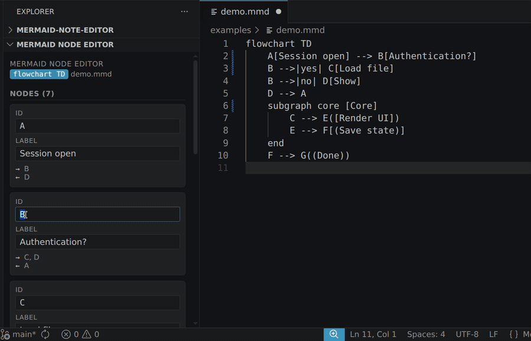

# Mermaid Node Editor

A VS Code extension that adds a **visual property editor** for Mermaid flowchart nodes. Click into a diagram, edit a node's **label** and **ID** from a sidebar, and the change is written straight back into the source — no manual find-and-replace through raw syntax.

**Problem it solves:** Mermaid has no visual editing layer. Renaming a node ID means manually find-replacing every edge reference across the file. This extension gives you a property sidebar for Mermaid flowcharts instead.

<p align="center">
  
</p>

> Note: the project folder is `mermaid-note-editor` but the extension's identity is `mermaid-node-editor` (it edits *nodes*).

## Features (v1)

- Detects Mermaid code blocks in `.md` files and treats whole `.mmd` / `.mermaid` files as one diagram.
- Parses flowchart diagrams (`graph TD`, `graph LR`, `flowchart …`).
- Lists every defined node in the sidebar with **editable ID and Label** fields.
- **Auto-saves on blur** — leave a field and the source updates immediately.
- **ID rename propagates** to every edge reference in the block.
- Subgraph **titles** are editable.
- Read-only **connection list** per node (`→ outgoing`, `← incoming`).
- Theme-aware UI (uses VS Code CSS variables).

## Usage

1. Open a Markdown file with a ` ```mermaid ` block, or a `.mmd` file.
2. Put your cursor inside the diagram.
3. The **Mermaid Node Editor** panel (in the Explorer sidebar) populates with the diagram's nodes.
4. Edit an ID or Label and click away (blur) — the source updates.
5. Save the file as usual (`Ctrl/Cmd+S`) to persist to disk. Edits land in the editor buffer first, like any other refactor.

Command palette: **`Mermaid: Open Node Editor`** focuses the panel; **`Mermaid: Refresh Node Editor`** re-reads the diagram at the cursor.

## Supported node shapes

`A[rect]`, `A(round)`, `A([stadium])`, `A[[subroutine]]`, `A[(database)]`, `A((circle))`, `A{decision}`, `A{{hexagon}}`, `A>asymmetric]` — with quoted (`A["with spaces"]`) or unquoted labels. The original bracket shape and quoting are preserved on write-back.

## Development

```bash
npm install        # install dev deps (esbuild, typescript, @types)
npm run compile    # bundle -> dist/extension.js
npm run watch      # rebuild on change
npm test           # type-check + run parser/editor unit tests (node:test)
npm run typecheck  # type-check only
```

Then press **F5** in VS Code to launch an **Extension Development Host** with the extension loaded. Open a `.mmd` file and the panel appears in the Explorer.

### Architecture

| File | Responsibility |
|---|---|
| `src/parser.ts` | Mermaid block detection + node/subgraph/edge extraction. Pure, vscode-free, regex line-by-line. |
| `src/editor.ts` | Write-back: label change, ID rename (with reference propagation), subgraph title. Returns edit descriptors; vscode-free. |
| `src/webview/panel.ts` | Webview lifecycle + message routing; applies edit descriptors via `WorkspaceEdit`. |
| `src/webview/{index.html,main.js,style.css}` | Sidebar UI (vanilla JS, theme-aware). |
| `src/extension.ts` | Activation, command + listener wiring. |

`parser.ts` and `editor.ts` carry the load — they are kept free of the `vscode` module so they unit-test in plain Node.

## Packaging

```bash
npm run package    # npx @vscode/vsce package -> mermaid-node-editor-0.1.0.vsix
code --install-extension mermaid-node-editor-0.1.0.vsix
```

Publishing to the Marketplace requires a publisher account and `vsce publish`.

## Known limitations

The editable fields (label / id / subgraph title) and the safe ID-rename are the supported surface. The **read-only connection list** is a best-effort convenience; its remaining gaps are all flowchart edge-parsing edge cases:

- Edge labels written as `A -- text --> B` (dash-delimited, not `|pipe|`) may add a spurious entry to the connection list. Pipe-form labels are handled correctly.
- Reversed-direction arrows (`B <-- A`) appear with the direction reversed in the connection list.
- Fan-out edges written `A & B --> C` are not parsed, so those connections are omitted.
- Only nodes defined with a bracketed label are editable; bare-referenced ids appear only in connection lists.
- A node whose id is literally `end` (a Mermaid keyword) is not detected.
- An unquoted label containing a `]` is read only up to the first `]` — quote such labels.
- Re-editing a `"`-quoted label that itself contains a `"` is not perfectly round-trip safe.

## License

MIT — see [LICENSE](LICENSE).
