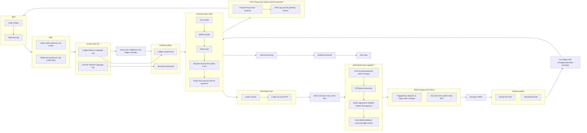

## Order / Day flow

```mermaid
graph LR

A --> B[order processing] --> C[fulfilment hand-off] --> D[Post-sale]

subgraph A["checkout open ritual"]
    direction TD
     AA1[Cart review] --> AA2[address loads] --> AA3[Rates load] --> AA4["Vouchers load (if the option is on)"] --> AA5[Things that need to load for payment]

end


subgraph AR1["AA3:Rates load"]
    direction LR
    RA1[Loads cached] --> RA2[Loads via carrier API]
end

A --> AR1
subgraph AR2["AA5:Things that need to load for payment"]
        direction LR
        RC1["Payment log (cross-session)"] --> RC2["Retry log (across gateway retries)"]
    end
subgraph BR1["What binds them together?"]
    direction TD
    BRR1["TOS+SLA(fundamental policy change)"] --> BRR2["OPS(store directives)"]--> BRR3["Audit Log(system initiated Pattern Recognition)"] --> BRR4["Issue Bank(catalog of recurring edge cases)"]

end

subgraph C1["Refund Approval Process"]
    direction TD
    BB2["Triggered by disputes at major order changes"]
    BB3["how does the system know this?"]
end
subgraph RBB2["Distilled artifact"]
    direction TD
    BBB4["Invoice Records"]
    BBB5["Receipt Records"]
end

subgraph RBB3["Distilled artifact"]

    BBB7["Ledger:compressed"]
    BBB8["Journal:compressed"]
end

subgraph BR2
    direction LR
    ARR1["Order artifact (format: ord-A-NN)"]
    ARR2["Shipment-log (format: ord-A-NN #NN)"]
end

subgraph BR3
    direction TD
    CCC1["Order Artifact"] -->
    CCC2["Shipment-log"]
end

subgraph DR1["At day close (C)"]

    DDR1["Ledger:Natural Language Log"]
    DDR2["Journal: Natural Language log"]
end

A --> AR2
AR1 --> AB["where do these rates come from"] --> BR1 --> C1 --> BBB1["manager ratifies"]--> RBB2 --> D1["Live ledger with Lineage(supersede-precede)"]
D1 --> A
DDR1 --> BBB7
DDR2 --> BBB8
AR2 --> BR3 --> BR2 --> DR1 --> CC1["at day end: distilled via the ledger compiler"] --> RBB3 --> A


```
